# Lab 04 – Configurarea Jenkins cu Docker, SSH Agent și Pipeline CI/CD

## Descrierea proiectului

Scopul acestui laborator este configurarea unui mediu Jenkins utilizând containere Docker, crearea unui agent SSH pentru execuția joburilor și configurarea unei pipeline CI/CD pentru un proiect PHP care conține teste unitare. Soluția include un Jenkins Controller, un agent configurat manual prin SSH și un Jenkinsfile pentru automatizarea procesului de instalare a dependințelor și rulare a testelor.

## Structura Proiectului

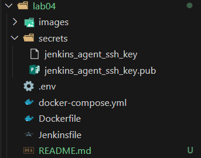

## Continutul Fisierelor

docker-compose.yml:

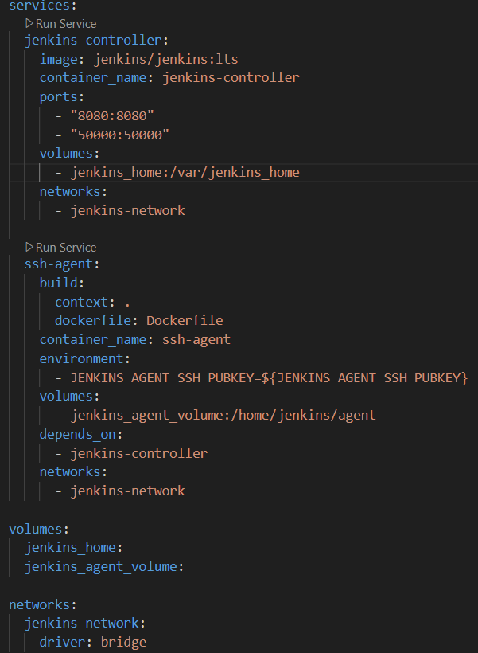

Dockerfile pentru SSH Agent:

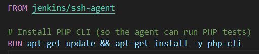

## Generarea cheilor SSH

Generarea ssh in directorul secrets si salvam continutul in .env:

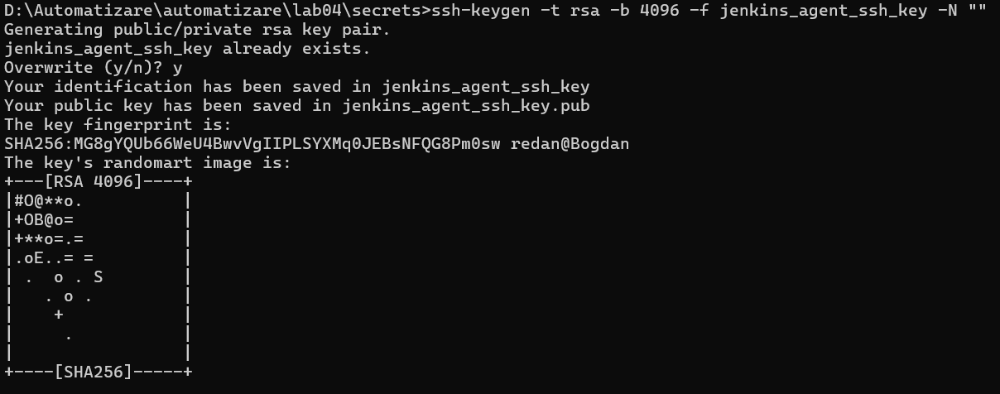

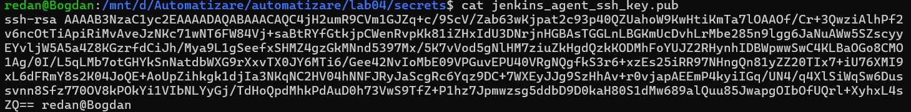

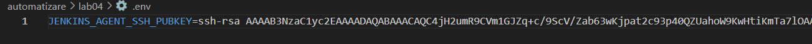

## Pornirea Jenkins

Construirea imaginii pentru agent și pornirea Jenkins + agent în containere separate:

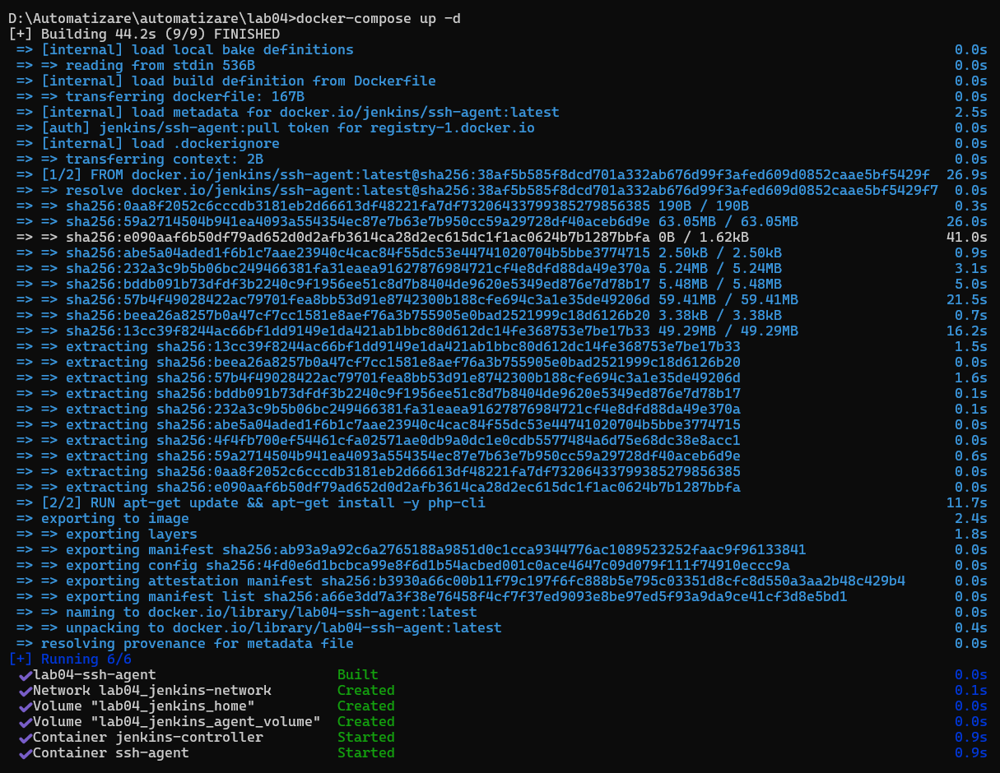

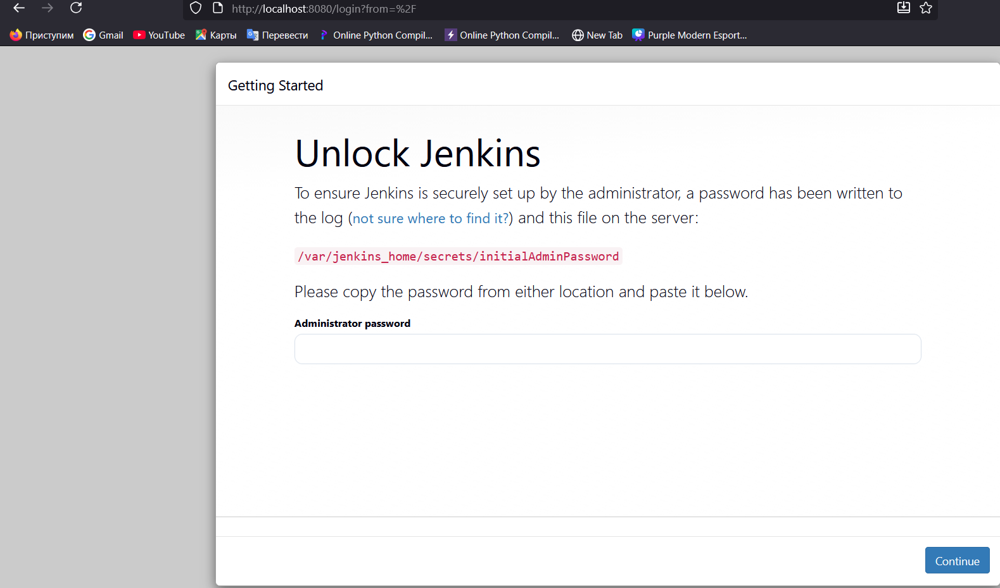

Pentru parola inițială:

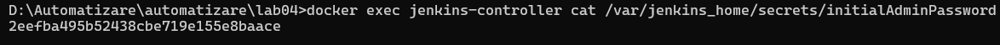

Instalarea pluginurilor sugerate:

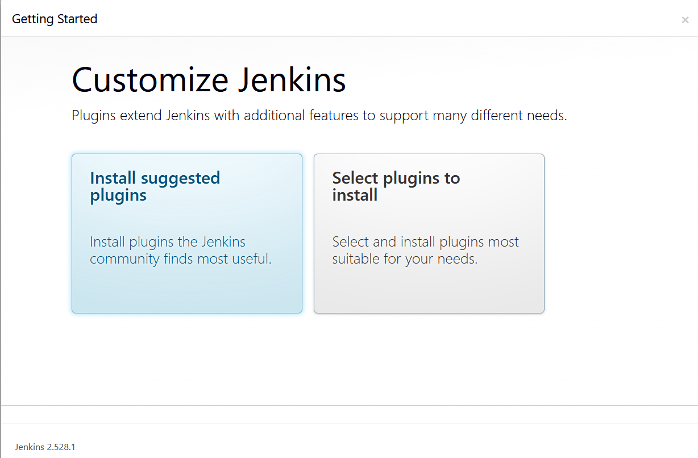

Crearea unui admin user:

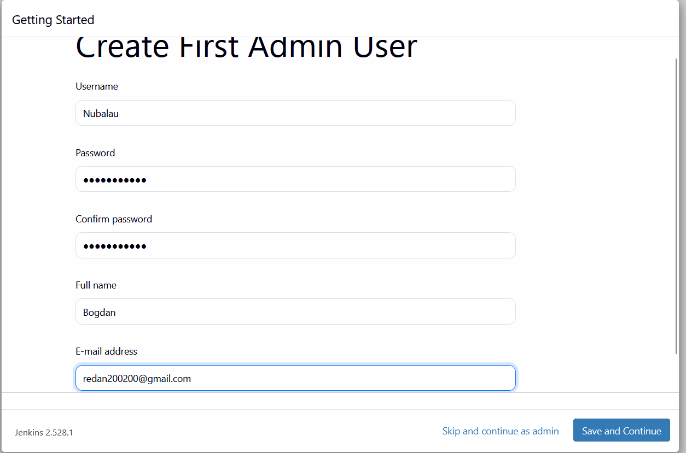

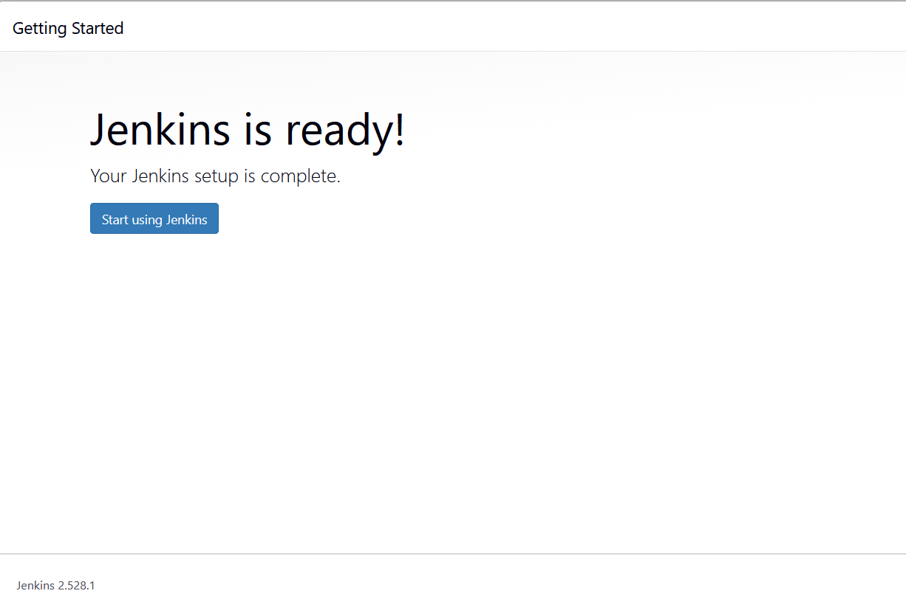

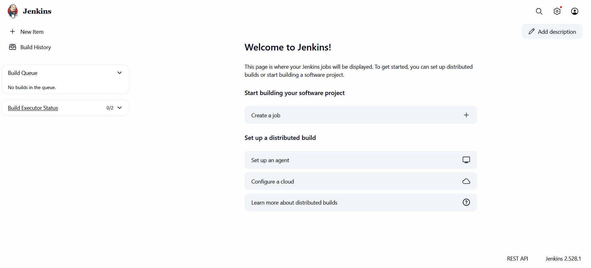

## Configurare SSH Agent în Jenkins

Adaudam credentiale cu cheia privata:

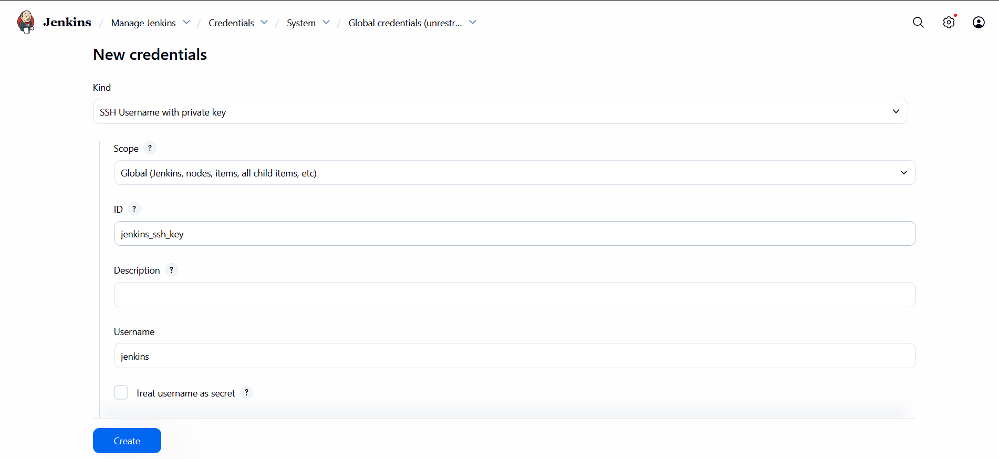

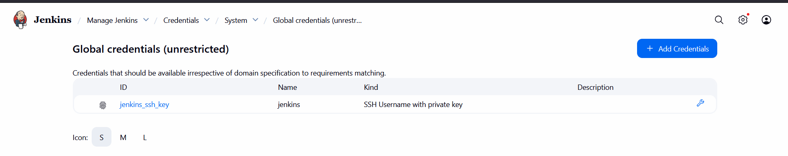

Creem un nou nod pentru shh-agent

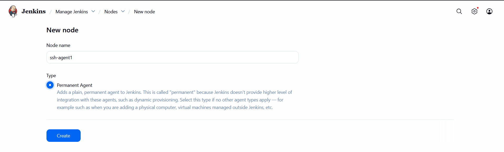

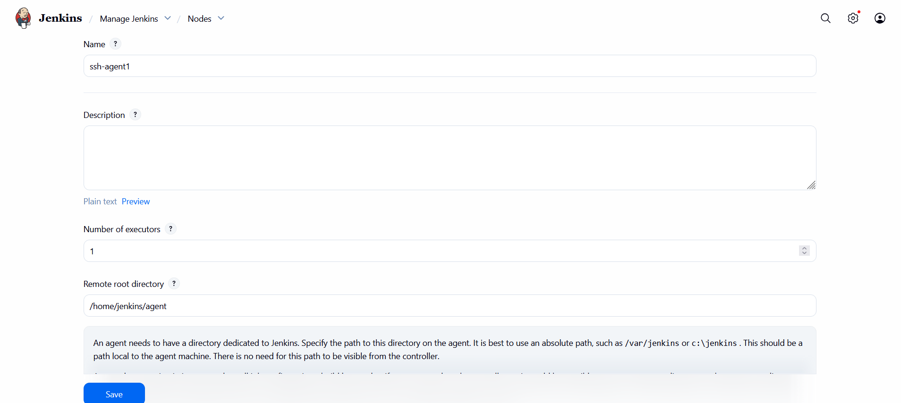

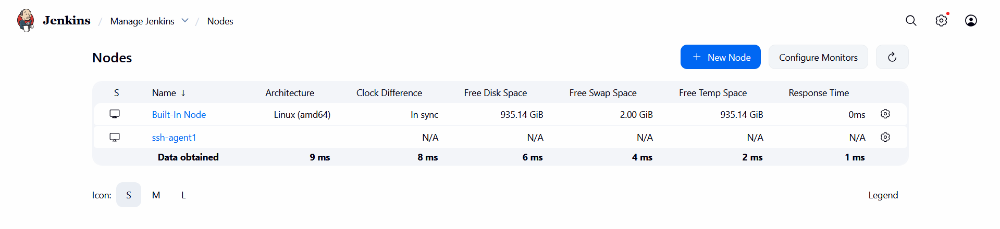

Fisierul Jenkinsfile pentru testare pipeline:

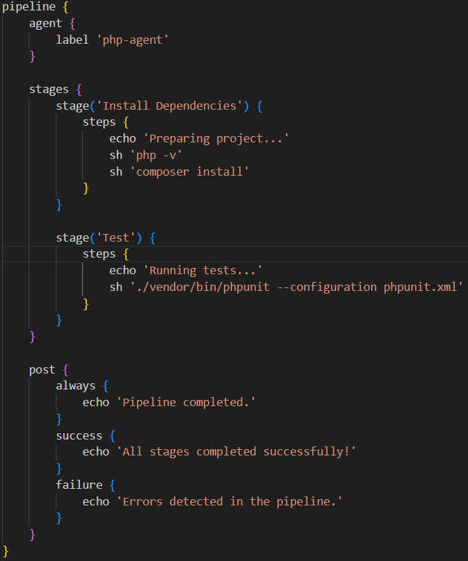

Testare pipeline:

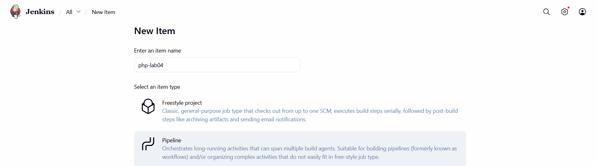

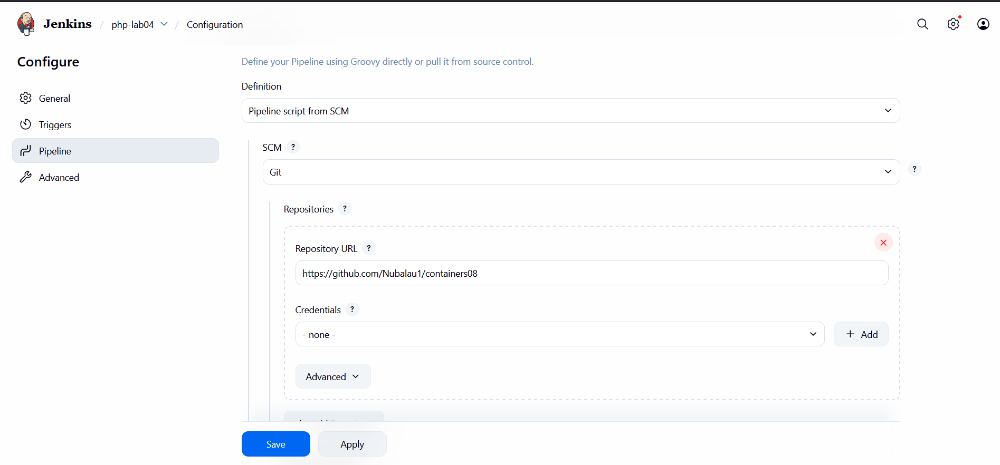

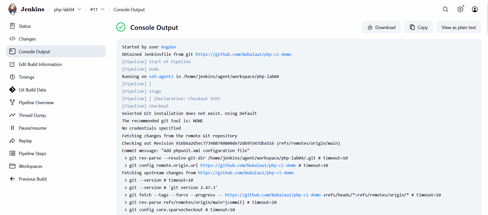

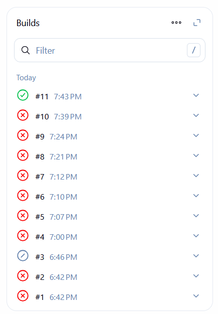

## Întrebări și răspunsuri

### Avantajele folosirii Jenkins pentru automatizarea DevOps

- Automatizează complet procesul CI/CD.

- Permite rularea testelor și verificări constante asupra codului.

- Extensibil prin plugin-uri.

- Poate lucra cu agenți multipli pe sisteme diferite.

- Suport excelent pentru Docker, GitHub și alte tool-uri DevOps.

### Tipuri de agenți Jenkins

- SSH Agents — folosiți în acest laborator.

- JNLP Agents — conectați din exterior prin protocolul JNLP.

- Docker Agents — fiecare build rulează într-un container.

- Kubernetes Agents — poduri dinamice create pe cerere.

- Static Agents — mașini fizice sau VM-uri cu agent instalat manual.

### Probleme întâlnite și soluții

- Agentul nu se conecta:	Verificare cheie SSH, host name, credentiale

- PHP nu era instalat pe agent:	Instalare php-cli prin Dockerfile

- Pipeline-ul eșua la Composer:	Am facut un repo php simplu si valid