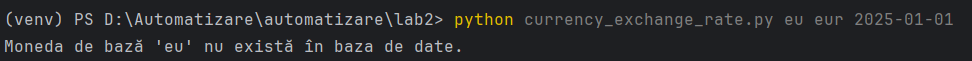

# Currency Conversion Script

Acest script permite extragerea cursului de schimb dintre două monede la o anumită dată, folosind API-ul public [@fawazahmed0/currency-api](https://github.com/fawazahmed0/exchange-api).

## Instalare

Pentru a rula scriptul, ai nevoie de Python **3.8+** și de pachetul `requests`.

Instalare pachet necesar:

```bash
pip install requests
```

## Rulare

Scriptul primește **3 parametri** în linia de comandă:

1. **Moneda sursă** (`from_currency`)
2. **Moneda țintă** (`to_currency`)
3. **Data** în format `YYYY-MM-DD` (trebuie să fie mai mică decât ziua curentă)

Exemple:

```bash
python currency_exchange_rate.py eur mdl 2025-02-01
python currency_exchange_rate.py mdl usd 2025-03-07
```

### Rezultate

* Dacă parametrii sunt corecți, rezultatul va fi salvat în folderul `data/` sub forma:

  ```
  data/{from_currency}_{to_currency}_{data}.json
  ```

  

  

* Dacă apar erori (parametri lipsă, dată invalidă, monede inexistente), mesajul este afișat și logat în `error.log`.

  
  Fisierul `error.log`:
  

## Structura scriptului

1. **Importuri și definiții**

   * Biblioteci: `requests`, `sys`, `json`, `os`, `datetime`
   * Funcție auxiliară: `log_error(message)` pentru scrierea erorilor în `error.log`

2. **Validare parametri**

   * Scriptul verifică dacă există exact 3 parametri
   * Validează formatul și corectitudinea datei (`YYYY-MM-DD` și mai mică decât azi)

3. **Interogare API**

   * Construiește URL-ul pentru moneda sursă
   * Verifică existența monedei sursă și disponibilitatea monedei țintă în răspunsul API

4. **Salvare rezultat**

   * Creează directorul `data` dacă nu există
   * Scrie cursul de schimb într-un fișier `.json` cu denumire unică bazată pe parametri

## Exemple fișier rezultat

Fișierul `eur_mdl_2025-02-01.json` va arăta astfel:

```json
{"data": "2025-02-01", "mdl": 19.32453592}
```
