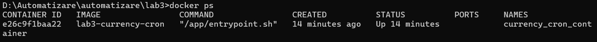
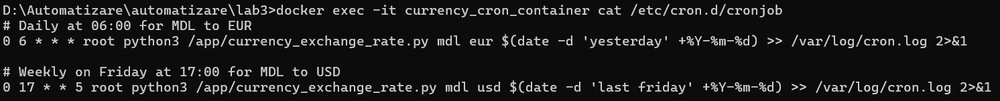
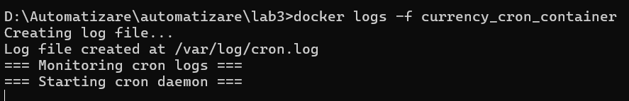
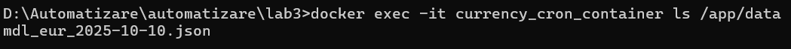
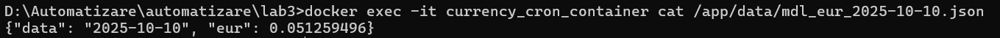

# Lab 03 – Automating Script Execution with Cron in Docker

## Objective

The goal of this lab is to learn how to configure the **task scheduler (`cron`)** inside a Docker container to automate the execution of Python scripts.

Specifically, we will:

- Schedule a Python script to run daily and weekly at specified times.
- Run cron jobs in a Docker container.
- Log the execution results.
- Use Docker Compose to simplify deployment.

---

## Project Structure
```bash
lab03/
├── currency_exchange_rate.py # Python script for fetching currency exchange rates
├── cronjob # Cron schedule file
├── Dockerfile # Docker image definition
├── docker-compose.yml # Docker Compose configuration
├── entrypoint.sh # Entrypoint script for setting up cron
└── README.md # Project documentation
```

### File Descriptions

- **`currency_exchange_rate.py`**  
  Fetches currency exchange rates (MDL → EUR / USD) for a given date using a public API and saves results to `data/` as JSON files.

- **`cronjob`**  
  Contains scheduled cron tasks:
  - Every day at 06:00 – get MDL→EUR rate for yesterday.
  - Every Friday at 17:00 – get MDL→USD rate for last Friday.

- **`Dockerfile`**  
  Builds a container with:
  - Python 3.11
  - Cron service
  - Project files
  - Required Python libraries.

- **`entrypoint.sh`**  
  Initializes log files, starts cron in the foreground, and tails the cron log so output is visible in the container logs.

- **`docker-compose.yml`**  
  Simplifies building and running the container.

---

## How to Build and Run the Container

### 1. Build the Docker image
```bash
docker-compose build
```

### 2. Start the container
```bash
docker-compose up -d
```

### 3. Check container status
```bash
docker ps
```


## How to Verify Cron Task Execution

### 1. View cron job schedule inside the container

```bash
docker exec -it currency_cron_container cat /etc/cron.d/cronjob
```


### 2. Monitor the cron logs

```bash
docker logs -f currency_cron_container
```


When the scheduled time is reached, the Python script will run and write output or errors to: /var/log/cron.log

## Manual Test

### 1. You can manually execute the script inside the container without waiting for the scheduled time:

```bash
docker exec -it currency_cron_container python3 /app/currency_exchange_rate.py mdl eur 2025-10-10
```

### 2. Check that a file is created

```bash
docker exec -it currency_cron_container ls /app/data
```


### 3. View the content

```bash
docker exec -it currency_cron_container cat /app/data/mdl_eur_2025-10-10.json

```


## Conclusion

In this lab, we successfully automated the execution of a Python script inside a Docker container using **cron**.  
